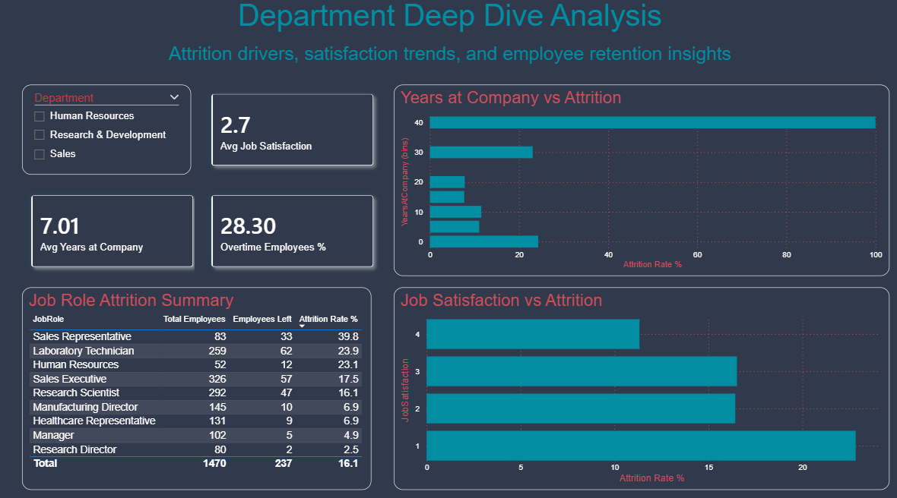

# HR Attrition Analytics

## Business Problem
A company is experiencing above-average employee attrition (16.1%).
The HR team needs data-driven insights to identify which departments,
roles, and factors drive employees to leave — and what to do about it.

## Objective
End-to-end HR analytics project: SQL analysis, Python EDA,
and an interactive Power BI dashboard for HR leadership.

## Dataset
- Source: IBM HR Analytics (Kaggle)
- Size: 1,470 employees | 35 features
- Link: https://www.kaggle.com/datasets/pavansubhasht/ibm-hr-analytics-attrition-dataset

## Tools Used
| Tool | Purpose |
|------|---------|
| SQL Server + VS Code | Data storage and querying |
| Python (pandas, seaborn) | EDA and attrition analysis |
| Power BI Desktop | Interactive HR dashboard |
| Jupyter (in VS Code) | Analysis notebook |

## Key Findings
1. Overall attrition rate: 16.1% (above 10-12% industry benchmark)
2. Sales dept has 20.6% attrition — highest across all departments
3. Overtime workers are 3x more likely to leave (30.5% vs 10.4%)
4. Employees who left earned ~$2,000/month less than those who stayed
5. Sales Representatives: 39.8% attrition — critically high

## Dashboard Preview
.png)


## Project Structure
```
hr-attrition-analytics/
├── data/raw/          ← IBM HR CSV
├── data/processed/    ← cleaned CSV
├── notebooks/         ← Python EDA notebook
├── sql/               ← all SQL queries
├── dashboards/        ← .pbix + screenshots
└── reports/           ← executive summary PDF
```

## How to Run
1. git clone <repo-url>
2. pip install -r requirements.txt
3. Open notebooks/01_HR_Attrition_EDA.ipynb in VS Code
4. Open dashboards/hr_attrition_dashboard.pbix in Power BI